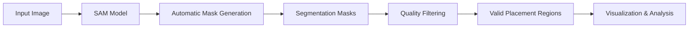

# 🌞 Solar Panel Placement using SAM3

<div align="center">


**An intelligent computer vision solution for automatic solar panel placement analysis using Meta's Segment Anything Model (SAM)**

[Features](#-features) • [Installation](#-installation) • [Usage](#-usage) • [Technology Stack](#-technology-stack) • [Methodology](#-methodology) • [Results](#-results)

</div>

---

## 📋 Overview

This project leverages **Meta's Segment Anything Model (SAM)**, a state-of-the-art foundation model for image segmentation, to automatically identify and segment optimal locations for solar panel placement. By utilizing the powerful SAM architecture with Vision Transformer (ViT) backbone, this tool can analyze aerial/satellite imagery and rooftop images to detect suitable surfaces for solar panel installation.

The system employs **automatic mask generation** to detect multiple regions of interest without requiring manual annotations, making it ideal for large-scale solar energy planning and feasibility studies.

## ✨ Features

- 🤖 **Automatic Segmentation**: Leverages SAM's automatic mask generation for zero-shot segmentation
- 🎯 **High Precision**: Uses ViT-H (Huge) backbone for maximum accuracy
- 📊 **Comprehensive Analysis**: Generates multiple valid placement regions with confidence scores
- 🔍 **Detailed Metrics**: Provides area, bounding box, predicted IOU, and stability scores for each segment
- 📈 **Visualization**: Built-in visualization tools using Supervision library
- 🚀 **GPU Accelerated**: CUDA support for faster processing
- 📝 **Interactive Notebook**: Complete Jupyter notebook workflow for experimentation

## 🛠 Technology Stack

| Component         | Technology                          |
| ----------------- | ----------------------------------- |
| **Core Model**    | Meta's Segment Anything Model (SAM) |
| **Backbone**      | Vision Transformer (ViT-H)          |
| **Framework**     | PyTorch                             |
| **Visualization** | Supervision, Matplotlib             |
| **Environment**   | Jupyter Notebook, Google Colab      |
| **Utilities**     | NumPy, OpenCV, Roboflow             |

## 📦 Installation

### Prerequisites

- Python 3.8 or higher
- CUDA-compatible GPU (recommended)
- 16GB+ RAM

### Setup Steps

1. **Clone the repository**
   ```bash
   git clone https://github.com/SahiL911999/Solar-Panel-Placement-SAM3.git
   cd Solar-Panel-Placement-SAM3
   ```

2. **Install Segment Anything Model**
   ```bash
   pip install git+https://github.com/facebookresearch/segment-anything.git
   ```

3. **Install dependencies**
   ```bash
   pip install jupyter_bbox_widget roboflow dataclasses-json supervision==0.23.0
   pip install opencv-python matplotlib numpy torch torchvision
   ```

4. **Download SAM weights**
   ```bash
   mkdir -p weights
   wget https://dl.fbaipublicfiles.com/segment_anything/sam_vit_h_4b8939.pth -P weights/
   ```

## 🚀 Usage

### Quick Start (Jupyter Notebook)

1. **Launch Jupyter Notebook**
   ```bash
   jupyter notebook Solar_Panels_Placement_using_SAM3.ipynb
   ```

2. **Run the cells sequentially**:
   - Import libraries and set up environment
   - Load the SAM model with pre-trained weights
   - Initialize the automatic mask generator
   - Load your image (aerial/rooftop view)
   - Generate masks for potential solar panel placement
   - Visualize and analyze results

### Basic Python Usage

```python
import torch
import cv2
from segment_anything import sam_model_registry, SamAutomaticMaskGenerator

# Setup
DEVICE = torch.device('cuda:0' if torch.cuda.is_available() else 'cpu')
MODEL_TYPE = "vit_h"
CHECKPOINT_PATH = "weights/sam_vit_h_4b8939.pth"

# Load model
sam = sam_model_registry[MODEL_TYPE](checkpoint=CHECKPOINT_PATH).to(device=DEVICE)
mask_generator = SamAutomaticMaskGenerator(sam)

# Load and process image
image = cv2.imread("path/to/your/rooftop/image.png")
image_rgb = cv2.cvtColor(image, cv2.COLOR_BGR2RGB)

# Generate masks
sam_result = mask_generator.generate(image_rgb)

# Results contain:
# - segmentation: binary mask
# - area: mask area in pixels
# - bbox: bounding box [x, y, width, height]
# - predicted_iou: model's quality prediction
# - stability_score: additional quality metric
```

## 🔬 Methodology

### Workflow Pipeline



### Model Architecture

The project uses SAM's **ViT-H (Huge)** architecture which consists of:

1. **Image Encoder**: Vision Transformer (ViT-H) with 632M parameters
2. **Prompt Encoder**: Lightweight encoder for points, boxes, and masks
3. **Mask Decoder**: Transformer-based decoder that predicts segmentation masks

### Automatic Mask Generation Process

1. **Grid Sampling**: SAM samples a grid of points across the image
2. **Mask Prediction**: For each point, multiple masks are predicted at different scales
3. **Quality Filtering**: Masks are filtered based on predicted IOU and stability scores
4. **Non-Maximum Suppression**: Overlapping masks are deduplicated
5. **Final Output**: High-quality, non-overlapping segmentation masks

## 📊 Results

Each generated mask provides:

| Metric              | Description                                  |
| ------------------- | -------------------------------------------- |
| **Segmentation**    | Binary mask array (W, H) with bool values    |
| **Area**            | Total area in pixels suitable for panels     |
| **Bounding Box**    | [x, y, width, height] in XYWH format         |
| **Predicted IOU**   | Model's confidence in mask quality (0-1)     |
| **Point Coords**    | Sampled point that generated the mask        |
| **Stability Score** | Additional quality metric (higher is better) |
| **Crop Box**        | Image crop used for generation               |

### Example Output

The visualization shows:
- ✅ Multiple detected roof surfaces
- 📏 Accurate boundary detection
- 🎨 Color-coded segments for different regions
- 📐 Bounding boxes for each placement area

## 🎯 Use Cases

- 🏠 **Residential Solar Planning**: Identify optimal rooftop areas for home solar installations
- 🏭 **Commercial Projects**: Large-scale analysis for industrial solar farms
- 🌍 **Urban Planning**: City-wide solar potential assessment
- 📊 **Feasibility Studies**: Quick evaluation of solar panel viability
- 🔍 **Site Surveys**: Automated preliminary analysis before manual inspection

## 🔧 Configuration Options

Customize the mask generator for different scenarios:

```python
mask_generator = SamAutomaticMaskGenerator(
    model=sam,
    points_per_side=32,              # Sampling grid density
    pred_iou_thresh=0.86,            # Quality threshold
    stability_score_thresh=0.92,     # Stability threshold
    crop_n_layers=1,                 # Crop processing layers
    crop_n_points_downscale_factor=2 # Downscale factor
)
```

## 📝 Project Structure

```
Solar-Panel-Placement-SAM3/
│
├── Solar_Panels_Placement_using_SAM3.ipynb  # Main notebook
├── weights/                                  # Model checkpoints
│   └── sam_vit_h_4b8939.pth
├── LICENSE                                   # MIT License
└── README.md                                 # This file
```

## 🚧 Future Enhancements

- [ ] Integration with GIS systems for coordinate mapping
- [ ] Calculate actual power generation potential based on area
- [ ] Support for 3D roof modeling
- [ ] Batch processing for multiple images
- [ ] Web application interface
- [ ] Integration with solar irradiance data
- [ ] Cost estimation module
- [ ] Export to CAD formats

## 🤝 Contributing

Contributions are welcome! Please feel free to submit a Pull Request. For major changes:

1. Fork the repository
2. Create your feature branch (`git checkout -b feature/AmazingFeature`)
3. Commit your changes (`git commit -m 'Add some AmazingFeature'`)
4. Push to the branch (`git push origin feature/AmazingFeature`)
5. Open a Pull Request

## 📜 License

This project is licensed under the MIT License - see the [LICENSE](LICENSE) file for details.

## 🙏 Acknowledgments

- **Meta AI Research** for the Segment Anything Model (SAM)
- **Facebook Research** for the pre-trained model weights
- **Roboflow** for computer vision utilities
- **Supervision** library for visualization tools

## 📚 References

- [SAM Paper](https://arxiv.org/abs/2304.02643) - "Segment Anything" by Kirillov et al.
- [SAM GitHub](https://github.com/facebookresearch/segment-anything) - Official implementation
- [SAM Demo](https://segment-anything.com/) - Interactive web demo

## 📧 Contact

For questions, suggestions, or collaborations, please open an issue on GitHub.

---

<div align="center">

### 🌟 Star this repository if you found it helpful!

**Repository**: [Solar-Panel-Placement-SAM3](https://github.com/SahiL911999/Solar-Panel-Placement-SAM3)

</div>

---

## 👨‍💻 Author

**Sahil Ranmbail**

- 🔗 GitHub: [@SahiL911999](https://github.com/SahiL911999)
- 📧 Professional & Innovative Developer
- 🎯 Passionate about AI/ML and Computer Vision
- 🌱 Contributing to sustainable energy solutions through technology

<div align="center">

*Developed with ❤️ for a sustainable future*

**© 2024 Sahil Ranmbail. All Rights Reserved.**

</div>
